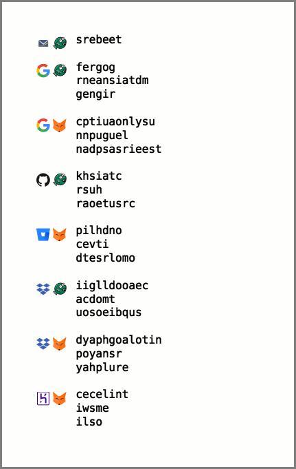

**This is not a complete project.**

A quick tool to help me put together a wallet card of 2FA backup codes.

It outputs an SVG that gives you something like this:



It's written in [crystal](https://crystal-lang.org/).

### What do I do?

Configure personas, services, and their codes in settings.toml.

There's no friendly configuration for layout settings, so you'll have to muck about in main.cr if you want to change anything about that.

Put your images in images/.  They'll be boxed into a square, so they should probably be squareish.

Once you've got that set, run `crystal main.cr > card.svg`. (You could also actually compile the program with `crystal build main.cr`, then `./main > card.svg` to run it.)

I then put that SVG into an HTML document for sizing and printing, which you can see as card.html.

### How do I configure?

There are two things you'll be configuring:

1. **Personas.**  I often have personal and work accounts with the same service, so I have two personas, "personal" and "work".  They each have an associated image, which is how you'll be able to tell them apart on the card.

2. **Services.**  A service is the place the codes are for, e.g. Google or Heroku.

Configuration is in settings.toml.

Personas are configured like this:

```toml
[personas]
  
  [personas.personal]
  image = "me.svg"

  [personas.work]
  image = "work.svg"
```

In the sample you see above, the fox (me.svg) represents my personal persona and the fish (work.svg) represents my work persona.

Services are configured like this:

```toml
[services]

  [services.google_me]
  persona = "personal"
  image = "google.svg"
  codes = ["fergog", "rneansiatdm", "gengir"]

  [services.google_work]
  persona = "work"
  image = "google.svg"
  codes = ["cptiuaonlysu", "nnpuguel", "nadpsasrieest"]
```

`codes` is an array of codes used to log in. Lots of services give me ten or a dozen codes, but I only bother printing three of them up.  Different services don't need to have the same number of codes.

### To-Do

* configure layout settings outside of the program itself
* auto-generate the HTML frame
